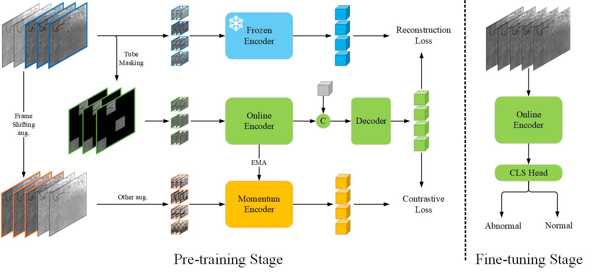

# [MICCAI 2025] Official Implementation of ConMVM



## Installation
The required packages are in the file [requirements.txt](requirements.txt), and you can run the following command to install the environment
```shell
conda create --name conmvm python=3.10 -y
conda activate conmvm

conda install pytorch==1.12.1 torchvision==0.13.1 torchaudio==0.12.1 -c pytorch

pip install -r requirements.txt
```

## Pre-training
The pre-training data list file (.csv) is in the following format:
> **[ without header ]**  
> frame_path_prefix,start_index,total_frames  

We provide the **off-the-shelf** distributed training scripts in the [scripts folder](scripts/pretrain.sh). Below we give an example of the pre-training script.
```shell
bash scripts/pretrain.sh
```

## Fine-tuning
The finetuning data list file (.csv) is in the following format:
> **folder \t video \t label**   
> /path/to/folder \t *.dcm \t 0  

where `\t` denotes tab size.

We provide the **off-the-shelf** distributed training scripts in the [scripts folder](scripts/finetune.sh). Below we give an example of the finetuning script.
```shell
bash scripts/finetune.sh
```

## Acknowledgement
The pretraining and finetuning of our project are based on [VideoMAEv2](https://github.com/OpenGVLab/VideoMAEv2). Thanks for their wonderful work.
